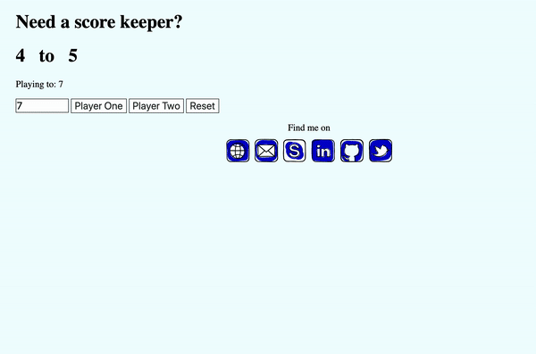

# Scorekeeper
First HTML and JS own project ever written by yours truly


## Screenshots



## Live Demo
To see the app in action, go to (https://funkateer.github.io/scoreKeeper/)


## Features
- Counts the score between 2 players and when somebody wins Jakes will cheer


## Tech/framework used
```
HTML5
```


## Contribute
1. Fork it (<https://github.com/Funkateer/scoreKeepr.git>)
2. Create your feature branch (`git checkout -b feature/fooBar`)
3. Commit your changes (`git commit -am 'Add some fooBar'`)
4. Push to the branch (`git push origin feature/fooBar`)
5. Create a new Pull Request


## Authors
* **Ala Eddin Abugrara** - alaeddin.abugrara@gmail.com

Project Link: https://github.com/Funkateer/scoreKeepr


## Contact
Alà Eddin Abugrara - [website](http://www.alabugrara.com) - [@twitter](https://twitter.com/twitter_handle) - [Github](https://github.com/Funkateer) - [Linked-in](https://www.linkedin.com/in/al%C3%A0-eddin-abugrara-214ba5115/)


<!-- Markdown links & imgs  -->
